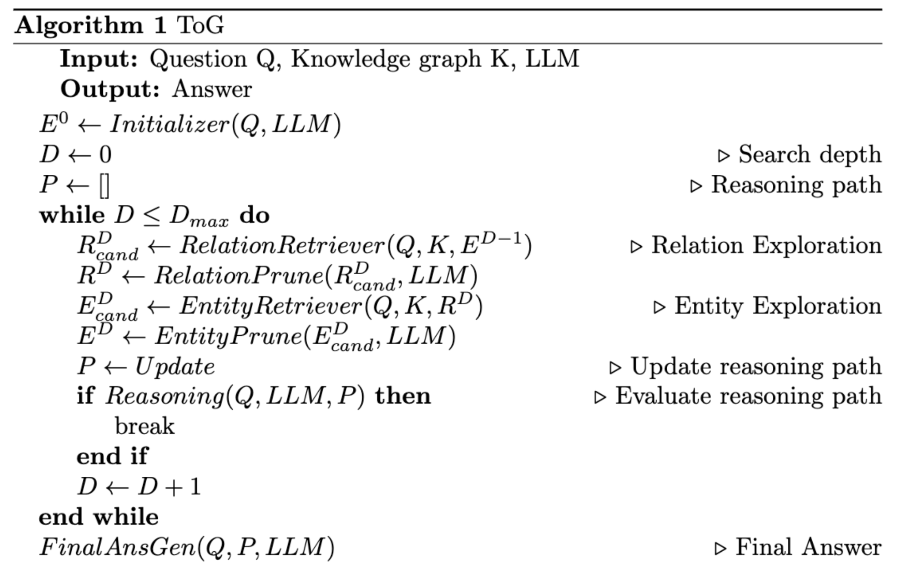

# Paper Implementation
## 💭Think-on-Graph: Deep and Responsible Reasoning of Large Language Model on Knowledge Graph (ICLR 2024)   
📑 Paper: [link](https://arxiv.org/pdf/2307.07697)  
💾 Original Repo: [link](https://github.com/IDEA-FinAI/ToG)  

The following are the implementations I developed after reading and studying the research paper:

## Summary
The paper introduces the Think-on-Graph (ToG) framework, which uses LLMs as agents to enhance KG reasoning for better decision-making. To address hallucination issues in deep and responsible reasoning, the authors propose a new paradigm where LLMs and KGs complement each other in each step of graph reasoning. Given an input question, ToG first identifies initial entities. Then iteratively calls the LLM to retrieve relevant triples from KGs through exploration and reasoning until adequate information through the top-N reasoning paths in beam search is gathered to answer the question or the predefined maximum search depth is reached.  

## Pseudocode

This pseudocode is implemented using the modules described below:

## Modules

### 1. Top Module
- **Input**: question, knowledge graph, LLM  
- **Output**: answer  

When a question is given, LLM-based modules and the Retriever interact to explore reasoning paths on the KG. The exploration concludes, and an answer is generated and returned. The maximum exploration depth (Dmax) follows the predefined values in the paper.

### 2. Initializer
- **Input**: question, LLM  
- **Output**: top-N topic entities  

The LLM is prompted to extract topic entities from the question.

### 3. Exploration
SPARQL queries are executed on Wikidata.

#### 3-1. Relation Exploration

#### a. Relations Retriever
- **Input**: question, knowledge graph, tail entities  
- **Output**: set of all relations linked to the tail entities  

#### b. Relation Prune
- **Input**: set of all relations (output of relations retriever), LLM  
- **Output**: top-N relations  

#### 3-2. Entity Exploration

#### a. Entities Retriever
- **Input**: question, knowledge graph, set of (tail entity, relation) pairs  
- **Output**: set of all entities forming triples with the given tail entity, relation pairs  

#### b. Entity Prune
1. The LLM is prompted with the given entity set to score each entity based on its relevance to answering the question.
2. The top-N entities are determined based on these scores.
- **Input**: set of all entities (output of entities retriever), LLM  
- **Output**: top-N entities  

### 4. Evaluation (Reasoning)
- **Input**: question, current reasoning paths, LLM  
- **Output**: whether the reasoning paths are adequate for generating the answer  
If the response is "Yes," the Final Answer Generator is executed. If "No," the Exploration module is executed again. This exploration process is repeated until either sufficient reasoning paths are obtained (Yes) or the maximum search depth is reached, concluding the exploration.

### 5. Final Answer Generator
- **Input**: question, reasoning paths, LLM  
- **Output**: answer  

## Implementation Details
* Dataset: QALD-10 (English Version)
* Metric: Exact Match Accuracy (Hits@1)
* Model: Llama2-70B-hf [(Hugging Face)](https://huggingface.co/meta-llama/Llama-2-70b-hf)
* Knowledge Graph: Wikidata [(link)](https://www.wikidata.org/wiki/Wikidata:REST_API)
* Hyperparameters  
  The implementation follows the hyperparameters defined in the paper:
  - **Temperature**:
    - 0.4 for exploration
    - 0 for reasoning
  - **Max Token Length for Generation**:
    - 256 tokens
  - **Beam Search Parameters**:
    - Width (N): 3
    - Maximum Depth (Dmax): 3
  - **Few Shot Number**:
    - 5 examples
