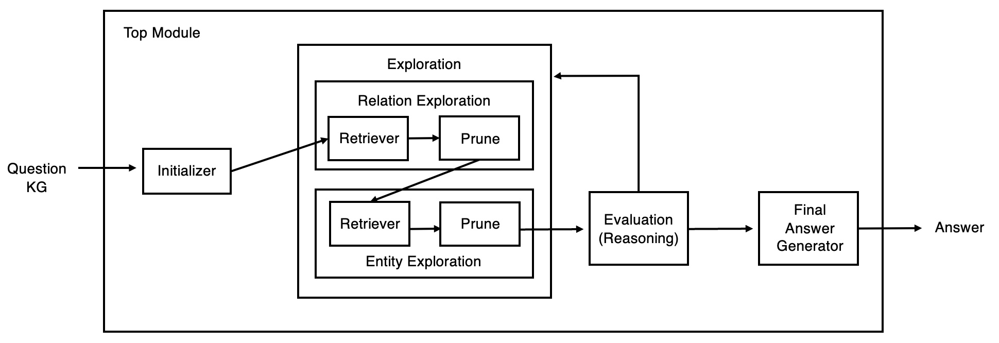

# Paper Implementation
* Think-on-Graph: Deep and Responsible Reasoning of Large Language Model on Knowledge Graph (ICLR 2024)  
- **Paper**: [link](https://arxiv.org/pdf/2307.07697)

## Implementation Goals
The primary objective is to implement the ToG Method and replicate the experiments detailed in the paper.

## Implementation Details
### Dataset
- **KBQA**: QALD-10 (English Version)

### Metric
- Exact Match Accuracy (Hits@1)

### Model
- **Llama2-70B-hf** [(Hugging Face)](https://huggingface.co/meta-llama/Llama-2-70b-hf)

### Knowledge Graph
- **Wikidata** [(link)](https://www.wikidata.org/wiki/Wikidata:REST_API)

## Hyperparameters
The implementation follows the hyperparameters defined in the paper:
- **Temperature**:
  - 0.4 for exploration
  - 0 for reasoning

- **Max Token Length for Generation**:
  - 256 tokens

- **Beam Search Parameters**:
  - Width (N): 3
  - Maximum Depth (Dmax): 3

- **Few Shot Number**:
  - 5 examples
